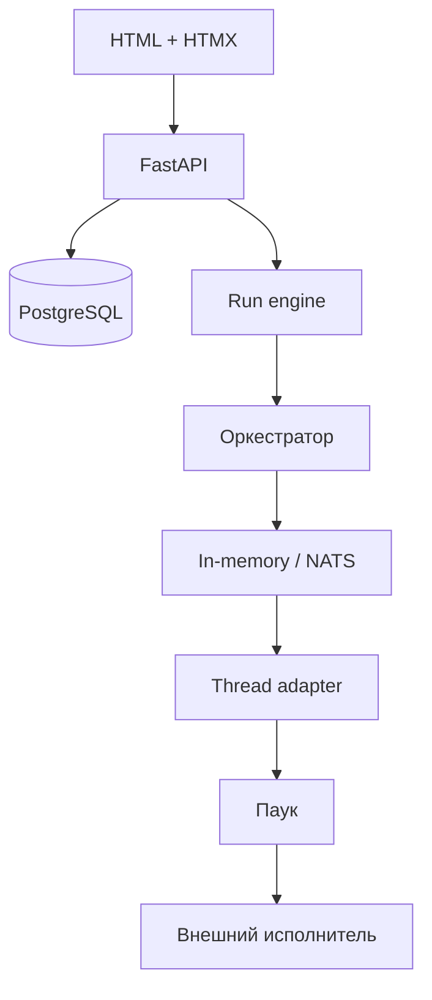

# Архитектура Arachne

Это короткая карта текущей реализации. Подробная версия:
[`docs/ru/architecture/overview.md`](docs/ru/architecture/overview.md).

## Главный принцип

Arachne владеет сценарием, но не притворяется системой сборки. Ядро решает, какой
шаг запустить, подставляет входы и переносит артефакты. Паук знает, как выполнить
один шаг во внешней системе.



## Границы ответственности

- **FastAPI** — сессии, HTML, формы, SSE и административные endpoints.
- **Scenario store** — компоненты, версии, публикация, bootstrap, ACL и экспорт.
- **Run engine** — создание run, live-буферы и финальная запись результата.
- **Оркестратор** — последовательность шагов, `${...}`, события и остановка на ошибке.
- **Thread client** — request к нити и подписка на лог.
- **Thread adapter** — жизненный цикл одного паука и упаковка ошибок.
- **Паук** — Forgejo, Ansible, OpenTofu или дочерний сценарий.
- **Шина** — `publish/subscribe` и `request/reply`.

## Контракт паука

Паук наследует `BuildSpider` или `ProvisionSpider`, задаёт `NAME` и реализует:

```python
dispatch(step, ctx) -> RunHandle
stream_logs(handle) -> AsyncIterator[LogLine]
get_status(handle) -> RunStatus
get_artifacts(handle) -> list[Artifact]
cancel(handle) -> bool
healthcheck() -> bool
```

Паук не знает о полном сценарии, DAG, ACL и шине. Адаптер выставляет его на subjects:

```text
arachne.thread.<kind>.<spider>.run
arachne.thread.<kind>.<spider>.cancel
arachne.thread.log.<run_id>.<step_id>
```

## Данные

PostgreSQL хранит пользователей, роли, команды, возможности, компоненты, сценарии,
версии, ACL и runs. Каждый run получает ID версии и неизменяемый snapshot сценария.

Live-логи живут в памяти процесса до завершения. Затем структурированные записи
сохраняются в `runs.log`, а ссылки на артефакты — в `runs.artifacts`.

## Шина

`InMemoryBus` — default для одного процесса. Он поддерживает NATS-подобные wildcards
`*` и `>`.

`NatsBus` использует тот же контракт и JSON wire codec. Он позволяет вынести нити
в другие процессы, но готового отдельного worker CLI в проекте пока нет.

## Поток выполнения

1. HTTP или триггер вызывает `fire_async`.
2. Движок сохраняет run и запускает async task.
3. Оркестратор разбирает steps сверху вниз.
4. `RunContext` разрешает `${params.x}` и `${step.field}`.
5. Thread client вызывает responder по шине.
6. Adapter гоняет lifecycle паука и публикует нумерованные строки лога.
7. Первый `failed`/`cancelled` останавливает дальнейшие шаги.
8. Движок сохраняет статус, лог и артефакты.

## Встроенные плагины

Пауки: `forgejo`, `ansible-local`, `tofu-proxmox`, заглушка `ansible-ovirt` и
вложенный `scenario`.

Триггеры: `manual`, `schedule` через APScheduler и `chain` через событие завершения.

## Ограничения

- шаги последовательны, `needs` зарезервирован;
- активные runs не восстанавливаются после рестарта;
- триггеры перечитываются только при старте;
- callback/hub Forgejo оставлен для совместимости, но основной паук его не использует;
- `ansible-ovirt` и dev fallbacks не являются production-исполнителями.

Полный список: [`docs/ru/reference/limitations.md`](docs/ru/reference/limitations.md).
