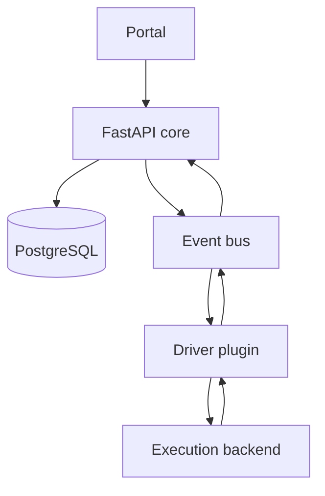

# Architecture overview

Arachne separates the portal and scenario model from execution backends.

Driver plugins implement dispatch, log streaming, status lookup, and artifact collection.
The in-memory bus is the default for a compact deployment; NATS is available when the
transport must be externalized.
