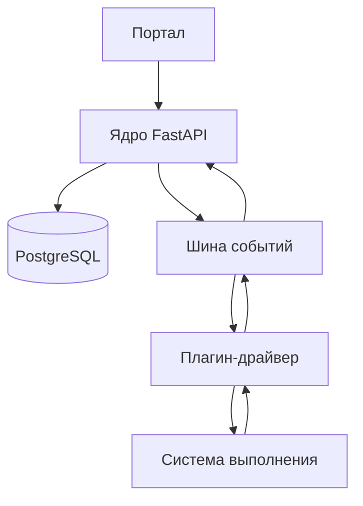

# Обзор архитектуры

Arachne отделяет портал и модель сценариев от систем выполнения.

Плагины-драйверы реализуют отправку задач, трансляцию логов, получение состояния
и сбор артефактов. Для компактного развёртывания по умолчанию используется шина
в памяти процесса; NATS доступен, когда транспорт нужно вынести наружу.
