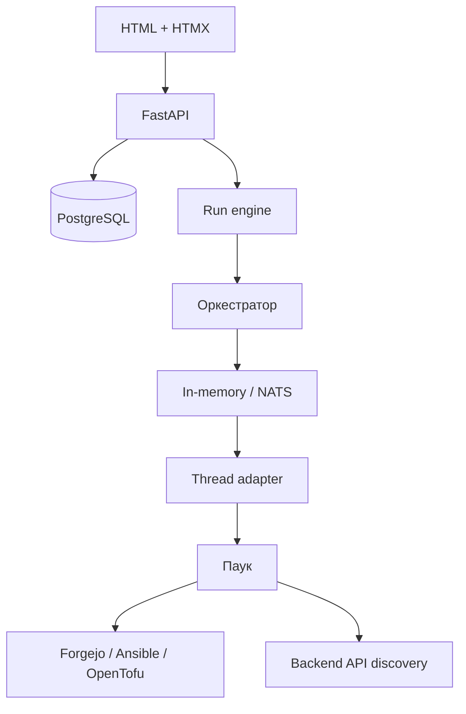
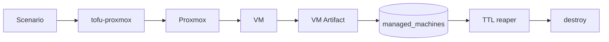

# Обзор архитектуры

Arachne разделяет пользовательское намерение, оркестрацию и конкретную реализацию backend-а. Сценарий говорит, что нужно получить. Spider знает, как это сделать.

Для инфраструктуры действует отдельное правило:

> Пользователь получает машину, а не набор параметров OpenTofu или Proxmox.


```mermaid
flowchart TD
    UI["HTML + HTMX"] --> API["FastAPI"]
    API --> DB[(PostgreSQL)]
    API --> Engine["Run engine"]
    Engine --> Core["Оркестратор"]
    Core --> Bus["In-memory / NATS"]
    Bus --> Adapter["Thread adapter"]
    Adapter --> Spider["Паук"]
    Spider --> Backend["Forgejo / Ansible / OpenTofu"]
    Spider --> InfraAPI["Backend API discovery"]
```

## Слои

| Слой | Ответственность |
|---|---|
| FastAPI | сессии, HTML, административные формы, SSE и callback endpoints |
| Scenario store | версии, публикация, bootstrap, ACL и YAML-экспорт |
| Run engine | запись run в БД, live-буферы, structured artifacts, финальная запись |
| Оркестратор | последовательность шагов, `${...}`, остановка на ошибке, события |
| Thread client | request по шине и подписка на лог конкретного шага |
| Thread adapter | жизненный цикл одного паука и структурные ошибки |
| Паук | конкретный внешний backend и перевод пользовательского intent в backend operations |
| Backend discovery | чтение фактической инфраструктурной конфигурации из API внешней системы |
| Шина | pub/sub и request/reply |

## Поток одного шага

1. оркестратор разрешает ссылки в `with`;
2. thread client подписывается на `arachne.thread.log.<run>.<step>`;
3. request уходит в `arachne.thread.<kind>.<spider>.run`;
4. adapter вызывает `dispatch`, затем `stream_logs`, `get_status`, `get_artifacts`;
5. каждая строка получает `step_id` и возрастающий `seq`;
6. результат сериализуется обратно в общий контракт;
7. structured artifacts записываются в run и контекст следующих шагов.

Отмена публикуется в `arachne.thread.<kind>.<spider>.cancel`.

## Шина

Контракт состоит из `publish`, `subscribe`, `unsubscribe`, `request`, `reply`.
In-memory backend поддерживает wildcards `*` и `>` в стиле NATS. Один responder обслуживает точный subject; при отсутствии responder возвращается структурная транспортная ошибка.

NATS сериализует payload в JSON. `Artifact`, `RunHandle`, `StepSpec` и ошибки проходят через явный wire codec.

## Данные

PostgreSQL хранит:

- пользователей, роли, команды и возможности;
- компоненты, сценарии, версии и ACL;
- runs и structured artifacts;
- Golden Image profiles;
- managed machines и их lifecycle state.

Live-логи до окончания run находятся в памяти, затем сохраняются JSON-массивом в текстовом поле `runs.log`.

Каждый run сохраняет `scenario_version_id` и `scenario_snapshot`, поэтому история остаётся привязана к версии на момент запуска.

## Golden Image как слой соответствия

Golden Image profile не является копией Proxmox VM configuration.

```text
Human profile
  redos8
     |
     v
PostgreSQL mapping
  template_vm_id = 9002
     |
     v
Proxmox API
  node / CPU / RAM / disk / storage
```

PostgreSQL хранит только человеческое соответствие. Proxmox остаётся источником истины для фактических характеристик template.

Поэтому перенос template между node или изменение storage не требует синхронизации `.env`.

## Lifecycle временной машины

После успешного provision VM artifact регистрируется как managed machine:


```mermaid
flowchart LR
    Scenario[Scenario] --> Spider[tofu-proxmox]
    Spider --> PVE[Proxmox]
    PVE --> VM[VM]
    VM --> Artifact[VM Artifact]
    Artifact --> MM[(managed_machines)]
    MM --> TTL[TTL reaper]
    TTL --> Destroy[destroy]
```

`managed_machines` хранит пользовательскую идентичность машины и backend metadata, достаточные для дальнейшего lifecycle.

Если задан `lifetime`, Arachne вычисляет абсолютный `expires_at`. Scheduler раз в минуту выбирает просроченные записи и запускает обычный destroy.

Переходы:

```text
running -> destroying -> destroyed
              |
              v
          reap_failed
              |
              +---- retry
```

Claim на destroy имеет lease. Поэтому падение Arachne после захвата записи не делает VM бессмертной.

## Почему destroy не зависит от текущего Golden Image

Профиль может измениться после создания машины:

```text
вчера: redos8 -> 9002
сегодня: redos8 -> 9100
```

Новый provision использует 9100. Старый stand должен удаляться независимо от этой смены.

Поэтому backend metadata исходной созданной VM сохраняются вместе с managed machine. Lifecycle конкретного ресурса не пересчитывается из текущей конфигурации профиля.

## События

Ядро публикует:

- `arachne.event.run.started`;
- `arachne.event.run.completed`;
- `arachne.event.run.failed`.

Chain trigger подписывается на completed. Failed публикуется дополнительно для специализированных слушателей, но chain сравнивает поле status события completed.

## Архитектурная граница

Уровни не должны протекать вверх:

```text
Scenario:      os, image, lifetime, resources
Golden Image:  profile -> template
Spider:        discovery + translation
OpenTofu:      provider/resource mechanics
Proxmox:       фактическая инфраструктура
```

Если новый пользовательский параметр требует знать node, datastore, provider variable или формат API token, граница нарушена. Такие детали должны оставаться в spider/backend layer.
