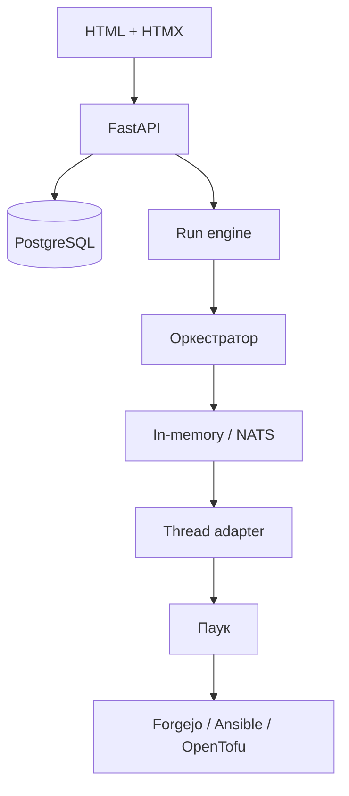

# Обзор архитектуры

Arachne разделяет управление сценарием и выполнение шагов. Ядро выбирает следующий
шаг и готовит входы. Паук работает с одной внешней системой.

```mermaid
flowchart TD
    UI["HTML + HTMX"] --> API["FastAPI"]
    API --> DB[(PostgreSQL)]
    API --> Engine["Run engine"]
    Engine --> Core["Оркестратор"]
    Core --> Bus["In-memory / NATS"]
    Bus --> Adapter["Thread adapter"]
    Adapter --> Spider["Паук"]
    Spider --> Backend["Forgejo / Ansible / OpenTofu"]
```

## Слои

| Слой | Ответственность |
|---|---|
| FastAPI | сессии, HTML, административные формы, SSE и callback endpoints |
| Scenario store | версии, публикация, bootstrap, ACL и YAML-экспорт |
| Run engine | запись run в БД, live-буферы, запуск async task, финальная запись |
| Оркестратор | последовательность шагов, `${...}`, остановка на ошибке, события |
| Thread client | request по шине и подписка на лог конкретного шага |
| Thread adapter | жизненный цикл одного паука и структурные ошибки |
| Паук | конкретный внешний backend |
| Шина | pub/sub и request/reply |

## Поток одного шага

1. оркестратор разрешает ссылки в `with`;
2. thread client подписывается на `arachne.thread.log.<run>.<step>`;
3. request уходит в `arachne.thread.<kind>.<spider>.run`;
4. adapter вызывает `dispatch`, затем `stream_logs`, `get_status`, `get_artifacts`;
5. каждая строка получает `step_id` и возрастающий `seq`;
6. результат сериализуется обратно в общий контракт;
7. артефакты записываются в контекст для следующего шага.

Отмена публикуется в `arachne.thread.<kind>.<spider>.cancel`.

## Шина

Контракт состоит из `publish`, `subscribe`, `unsubscribe`, `request`, `reply`.
In-memory backend поддерживает wildcards `*` и `>` в стиле NATS. Один responder
обслуживает точный subject; при отсутствии responder возвращается структурная
транспортная ошибка.

NATS сериализует payload в JSON. `Artifact`, `RunHandle`, `StepSpec` и ошибки
проходят через явный wire codec.

## Данные

PostgreSQL хранит пользователей, роли, команды, возможности, компоненты, сценарии,
версии, ACL и runs. Live-логи до окончания run находятся в памяти, затем сохраняются
JSON-массивом в текстовом поле `runs.log`.

Каждый run сохраняет `scenario_version_id` и `scenario_snapshot`, поэтому история
остаётся привязана к версии на момент запуска.

## События

Ядро публикует:

- `arachne.event.run.started`;
- `arachne.event.run.completed`;
- `arachne.event.run.failed`.

Chain trigger подписывается на completed. Failed публикуется дополнительно для
специализированных слушателей, но chain сравнивает поле status события completed.
